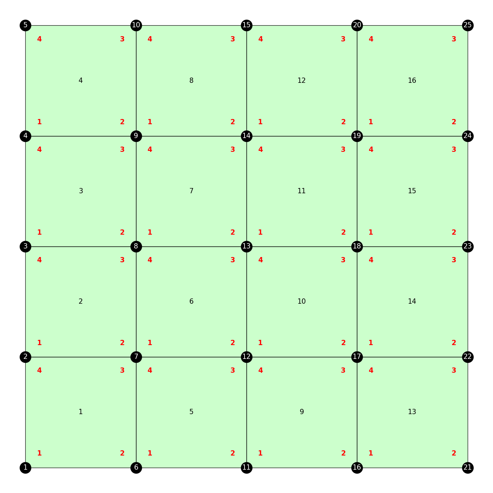
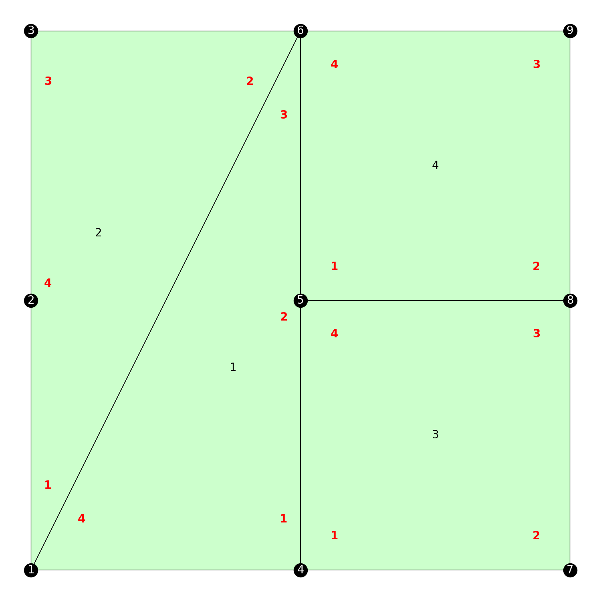
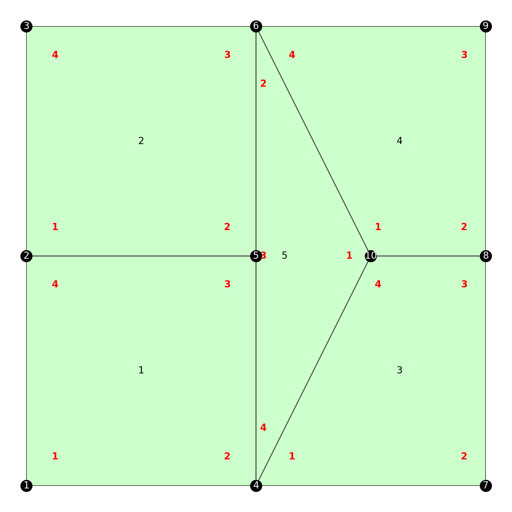
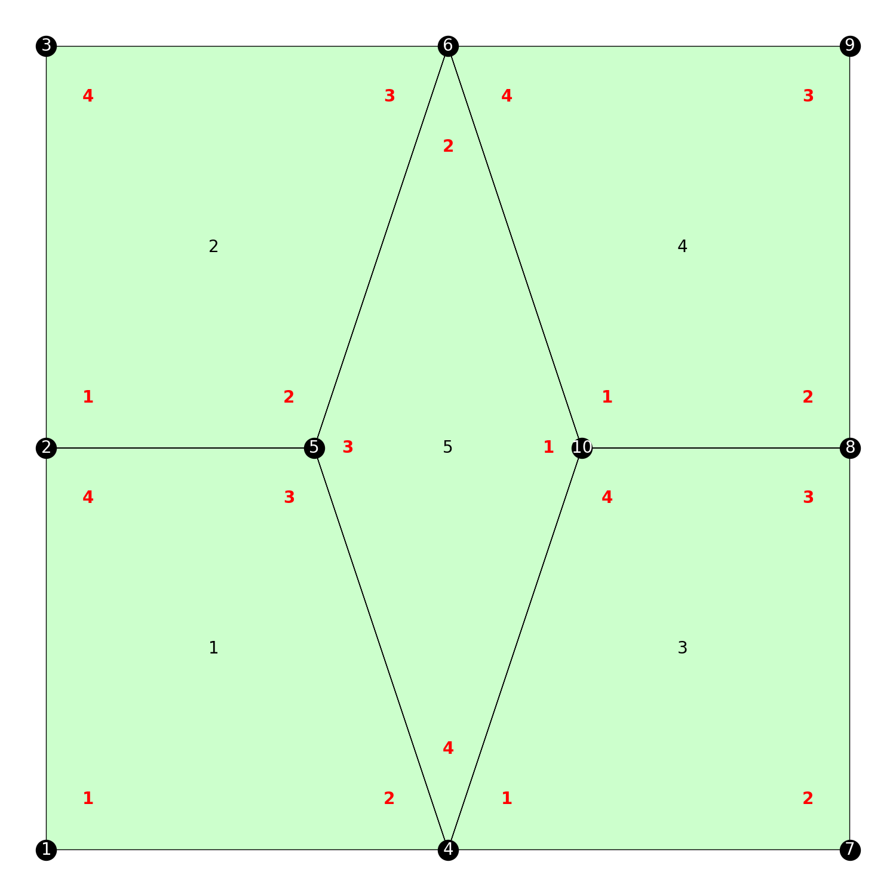
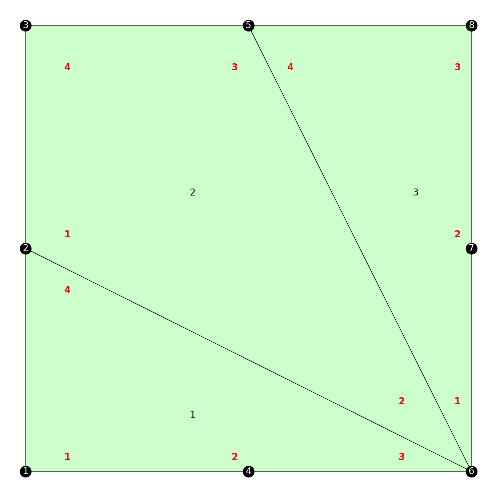

# QuadMeshGame

[](https://github.com/ArjunNarayanan/QuadMeshGame.jl/actions/workflows/CI.yml?query=branch%3Amain)

This package is heavily influenced by the ideas of [Per-Olof Persson](http://persson.berkeley.edu/).

This package implements connectivity editing operations on Quad Meshes. A Quad Mesh is a 2D mesh where all the elements are quadrilaterals. You can use the [PlotQuadMesh.jl](https://github.com/ArjunNarayanan/PlotQuadMesh.jl) package for visualization.

# Introduction

A Quad Mesh can be defined by providing the coordinates of the vertices and the connectivity of each quad element. As an example, let's create a `2x2` mesh:

```julia
using Revise
using QuadMeshGame
using PlotQuadMesh
QM = QuadMeshGame
PQ = PlotQuadMesh

vertices = [0.0 0.0 0.0 0.5 0.5 0.5 1.0 1.0 1.0
    0.0 0.5 1.0 0.0 0.5 1.0 0.0 0.5 1.0]
connectivity = [1 2 4 5
    4 5 7 8
    5 6 8 9
    2 3 5 6]
mesh = QM.QuadMesh(vertices, connectivity)
```

`vertices` is expected to be a `2 x num_vertices` matrix of vertex coordinates. `connectivity` is expected to be a `4 x num_quads` matrix of integers representing the connectivity of each quad (one quad per column). The vertices are assumed to be in counter-clockwise order. Note that this can be used to locally order the edges of each quad.

The `QuadMesh` object is dynamic -- the number of vertices and quads can change based on the editing operations (described later). Hence, we allocate a larger buffer to store the vertex coordinates and connectivity matrices and keep track of __active vertices__ and __active quads__. While visualizing, we should supply only the active vertices and quads to the plotter. 

We can do this as follows:

```julia
PQ.plot_mesh(QM.active_vertex_coordinates(mesh), QM.active_quad_connectivity(mesh), 
number_vertices=true, number_elements=true, internal_order=true)
```


The red numbers in the above figure refer to the local numbering of vertices in each quad. We use this to locally index the edges in each quad. For example `quad 2, edge 2` refers to the edge from vertex 5 to vertex 6 in the above figure.

The `QuadMesh` object contains some useful information. You can look at the connectivity between quads. This tells you the index of your neighboring quad across a particular local edge. 

```julia
julia> q2q = QM.active_quad_q2q(mesh)
4×4 Matrix{Int64}:
 0  1  0  3
 3  4  0  0
 2  0  4  0
 0  0  1  2
```

`q2q[3,1] = 2` says that the index of the quad neighboring quad 1 across local edge 3 is 2. A value of zero indicates a boundary.

You can obtain the local edge of your neighbor as follows:

```julia
julia> e2e = QM.active_quad_e2e(mesh)
4×4 Matrix{Int64}:
 0  3  0  3
 4  4  0  0
 1  0  1  0
 0  0  2  2
```

How do we interpret `e2e[1,4] = 3`? Note that quad 4 has as neighbor quad 3 across local edge 1. Note also that quad 3 has quad 4 as neighbor across local edge 3. This is what the `e2e` matrix stores. In particular,

```julia
q2q[e2e[e, q], q2q[e, q]] == q
```

`q2q` and `e2e` is a representation of the [Half-edge datastructure](https://cs184.eecs.berkeley.edu/sp19/article/15/the-half-edge-data-structure) which is an effective datastructure to store and manipulate the topology of meshes. What we have been referring to as "local edges" so far are in fact half-edges. For consistency with prior work, we will refer to them as half-edges from henceforth.

We can look at the degree (i.e. number of incident edges) of all the active vertices:

```julia
julia> QM.active_vertex_degrees(mesh)
9-element Vector{Int64}:
 2
 3
 2
 3
 4
 3
 2
 3
 2
```

You can use the `square_mesh` function to create a uniform mesh of size `n x n` with `n` quads along each side. This is mainly for testing and debugging,

```julia
julia> QM.square_mesh(4)
QuadMesh
        Num Vert : 25
        Num Quad : 16
julia> fig = PQ.plot_mesh(QM.active_vertex_coordinates(mesh), QM.active_quad_connectivity(mesh), 
number_vertices=true, number_elements=true, internal_order=true)
```



# Mesh Editing Operations

All the mesh editing operations are defined in terms of the half-edges.

## Edge Flips

An edge flip rotates an edge to get a new quad mesh. We provide `left_flip` and `right_flip` options to rotate the edge counterclockwise or clockwise respectively. The syntax is `left_flip!(mesh, quad_index, half_edge_index)`

Here's an example:

```julia
mesh = QM.square_mesh(2)
PQ.plot_mesh(QM.active_vertex_coordinates(mesh), QM.active_quad_connectivity(mesh), 
    number_vertices=true, number_elements=true, internal_order=true)
```


```julia
QM.left_flip!(mesh, 2, 1)
PQ.plot_mesh(QM.active_vertex_coordinates(mesh), QM.active_quad_connectivity(mesh), 
    number_vertices=true, number_elements=true, internal_order=true)
```



You can use the `is_valid_left_flip(mesh, quad_index, half_edge_index, max_degree)` to check if a particular flip is permitted or not (for example, you cannot flip a boundary half-edge). Flipping an edge changes the degrees of vertices. If an edge flip results in a vertex attaining degree greater than `max_degree`, `is_valid_left_flip` will return `false`. The default value is `max_degree = 7`.

All of the above applies to `right_flip!` and `is_valid_right_flip` with the difference being that the edge is rotated clockwise.

## Vertex split

A vertex split introduces a new vertex and a new quad. Even though we are splitting a vertex, we parameterize it in terms of half-edges, since one vertex can be split in multiple different ways. The syntax is `QuadMeshGame.split!(mesh, quad_index, half_edge_index)`.

Splitting a half-edge results in the duplication of it's origin vertex. This vertex is then moved to the average position of the source and destination. The original vertex, the duplicate, and vertices from the quads on either side of the half edge are used to construct a new quad. 

Here's an example,

```julia
mesh = QM.square_mesh(2)
fig = PQ.plot_mesh(QM.active_vertex_coordinates(mesh), QM.active_quad_connectivity(mesh), 
    number_vertices=true, number_elements=true, internal_order=true)
```


```julia
QM.split!(mesh, 4, 1)
```



A simple version of mesh smoothing is implemented,

```julia
QM.averagesmoothing!(mesh)
fig = PQ.plot_mesh(QM.active_vertex_coordinates(mesh), QM.active_quad_connectivity(mesh), 
    number_vertices=true, number_elements=true, internal_order=true)
```



Once again, you can use `QuadMeshGame.is_valid_split(mesh, quad_index, half_edge_index)` to check if a particular split is possible or not.


## Diamond collapse

A collapse can be seen as the inverse of a split. (`QuadMeshGame` does __not__ reverse the operation -- the indices of quads and vertices will not be reverted if you collapse a quad that was generated from a split.) Once again, we define the collapse in terms of half-edges. 

The syntax is `QuadMeshGame.collapse!(mesh, quad_index, half_edge_index)`. The quad `quad_index` is collapsed by merging the source vertex of `half_edge_index` with the vertex diagonally across in the quad `quad_index`. If either vertex is on the boundary, the merged vertex is located on the boundary. Otherwise, the merged vertex is placed at the average position of the original vertices. Here's an example,

```julia
mesh = QM.square_mesh(2)
QM.collapse!(mesh, 4, 1)
fig = PQ.plot_mesh(QM.active_vertex_coordinates(mesh), QM.active_quad_connectivity(mesh), 
    number_vertices=true, number_elements=true, internal_order=true)
```


You can use `QuadMeshGame.is_valid_collapse(mesh, quad_index, half_edge_index)` to check if a particular collapse is possible or not.

## Reindexing the mesh

Since we allocate buffers for the mesh object, you may end up with a situation where the `active_quad_connectivity` contains indices which are greater than the number of vertices in the `active_vertex_coordinates` matrix. If you try to plot, `PyPlot` will complain that you are accessing out of bounds. We therefore provide a function to reindex the quads and vertices in a `QuadMesh`.

Here's an example,

```julia
julia> mesh = QM.square_mesh(2)
QuadMesh
        Num Vert : 9
        Num Quad : 4


julia> QM.collapse!(mesh, 3, 2)
true

julia> QM.number_of_vertices(mesh)
8

julia> QM.active_quad_connectivity(mesh)
4×3 Matrix{Int64}:
 1  2  7
 4  7  8
 7  6  9
 2  3  6
 ```

 Observe that the mesh has 8 vertices -- since we collapsed quad 3, we ended up merging vertex 5 and 7, effectively deleting vertex 5. However, the quad connectivity is referencing vertex 9. We can understand this by looking at `mesh.active_vertex`

 ```julia
julia> mesh.active_vertex[1:9]
9-element BitVector:
 1
 1
 1
 1
 0
 1
 1
 1
 1
 ```

 Vertex 5 was deleted by simply setting it as inactive. If you try to plot this mesh you will get an error,

 ```julia
julia> fig = PQ.plot_mesh(QM.active_vertex_coordinates(mesh), QM.active_quad_connectivity(mesh), 
           number_vertices=true, number_elements=true, internal_order=true)
ERROR: PyError ($(Expr(:escape, :(ccall(#= /Users/arjun/.julia/packages/PyCall/7a7w0/src/pyfncall.jl:43 =# @pysym(:PyObject_Call), PyPtr, (PyPtr, PyPtr, PyPtr), o, pyargsptr, kw))))) <class 'ValueError'>
ValueError('triangles max element is out of bounds')
 ```

 You can plot after reindexing the mesh,

 ```julia
mesh = QM.square_mesh(2)
QM.collapse!(mesh, 3, 2)

QM.reindex_quads!(mesh)
QM.reindex_vertices!(mesh)

fig = PQ.plot_mesh(QM.active_vertex_coordinates(mesh), QM.active_quad_connectivity(mesh), 
    number_vertices=true, number_elements=true, internal_order=true)
 ```

 


 # Game Environment

 The above is starting to sound a little bit like a game. We have a board (or an _environment_) which is our mesh. We have _actions_ corresponding to flips, splits, and collapses. But what is our objective?

Most people would prefer the mesh on the left to the mesh on the right.

  

 What is fundamentally different about them? We think that __connectivity__ has an important effect on the __quality__ of a mesh. Looking at the uniform mesh on the left, we might conclude that for a quad mesh where the element sizes are more or less uniform, we would like the vertices in the interior of the mesh to have __degree 4__. (We will use the terms _degree_ and _valence_ interchangeably.) The desired degree of vertices on the boundary depends on the included angle between the two boundary edges incident at that vertex. For example if the angle is 180 degrees, we would like the degree to be 3 (observe the sides of the mesh on the left). If it is 90 degrees, we would like it to be 2 (observe the corners of the mesh on the left).

 We are interested in applying our actions on quad meshes to achieve a _desired degree_ on each vertex. In fact, the mesh on the right was generated by starting from the perfect mesh on the left and applying random actions on it. So at least in this synthetic case, there exists a way to convert the mesh on the right to the mesh on the left. Whether or not it is always possible to achieve a certain configuration is beyond my understanding, but I would love to hear your thoughts on it :)

 A useful measure that we can use to score our performance is the deviation from desired degree. This is just the difference between the desired degree and the current degree for each vertex. We will refer to this as the __vertex score__ where it is desirable to have a vertex score of 0 for all vertices. 
 
 `PlotQuadMesh` helps with visualizing the vertex scores. Here's an example,

 ```julia
mesh = QM.square_mesh(2)
desired_degree = deepcopy(QM.active_vertex_degrees(mesh))
QM.left_flip!(mesh, 1, 3)
current_degree = deepcopy(QM.active_vertex_degrees(mesh))
vertex_score = desired_degree - current_degree
PQ.plot_mesh(QM.active_vertex_coordinates(mesh), QM.active_quad_connectivity(mesh), vertex_score = vertex_score)
 ```


The quality of a mesh, in terms of its connectivity, can be boiled down to a single number as the sum of the absolute vertex scores `score = sum(abs.(vertex_score))`. We can try to optimize the connectivity of the mesh by driving down this score to zero. Note that all our actions are _zero sum_ i.e. `sum(vertex_score) = 0` before and after any action. Thus, we have a lower bound on our score since `abs(sum(vertex_score)) <= sum(abs.(vertex_score))`. I don't know if you can always achieve this optimum, but it is helpful to measure how well we are doing.

To deal with this setup, we provide a `GameEnv` with constructor `QuadMeshGame.GameEnv(mesh, desired_degree, max_actions)`.

```julia
julia> mesh = QM.square_mesh(3);
julia> desired_degree = [3,6,4,5,4,3,5,4,3,4,4,5,3,5,5,4];
julia> env = QM.GameEnv(mesh, desired_degree, 10)
GameEnv
        16 vertices
        9 quads
        21 current score
        10 remaining actions
```

The `GameEnv` keeps track of a few things for you. 

- `env.num_action` : the number of actions taken so far
- `env.current_score` : equal to `sum(abs.(env.vertex_score))`
- `env.opt_score` : the optimum score equal to `abs(sum(env.vertex_score))`
- `env.reward` : the reward for the previous action equal to the difference between `env.current_score` before and after the action.
- `env.is_terminated` : whether or not the environment is terminated. The `GameEnv` is said to be terminal if the number of actions exceeds `env.max_actions` or `env.current_score == env.opt_score`.

You can perform all the actions discussed above on the `GameEnv`, using the syntax `step_left_flip!(env, quad_index, half_edge_index)`, `step_right_flip!(env, quad_index, half_edge_index)`, `step_split!(env, quad_index, half_edge_index)`, and `step_collapse!(env, quad_index, half_edge_index)`. All of these functions accept a keyword argument `no_action_reward` -- if the requested action is not valid, the environment records this value as the reward. 


You've probably guessed that the language here is reminiscent of Reinforcement Learning. Please check out my other package [ProximalPolicyOptimization.jl](https://github.com/ArjunNarayanan/ProximalPolicyOptimization.jl) that implements the [proximal policy optimization](https://openai.com/blog/openai-baselines-ppo/) reinforcement learning algorithm to learn to optimize mesh topologies!